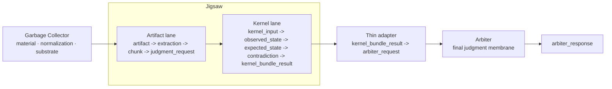

# Three-Layer Architecture Diagram

## Reading the diagram

- Garbage Collector prepares usable material and normalization boundaries.
- Jigsaw owns the middle lanes that shape artifacts and compose kernel-family outputs.
- The current Jigsaw to Arbiter connection is intentionally thin.
- Arbiter consumes the adapted case through its existing public membrane and returns a bounded judgment.

## Current pressure point

Jigsaw's kernel bundle surface is richer than Arbiter's current request membrane.

In the current proof this richer structure is compressed into narrower Arbiter fields such as `fit_score`. That is the main interface pressure signal exposed by the current milestone.
