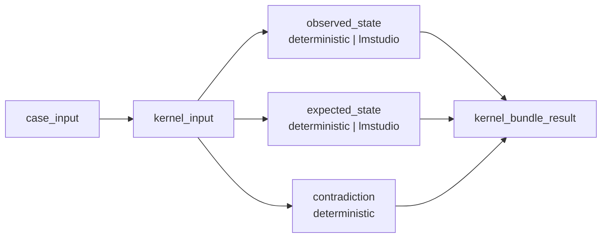

# Governed Forward-Pass Architecture Diagram

```mermaid
flowchart LR
    GC["Garbage Collector<br/>substrate intelligence<br/>ingest · organize · link · surface"]
    SNAP["gc_context_snapshot"]
    CTRL["Controller<br/>hypothesis state · next probe · package_case"]
    HYP["hypothesis_state"]
    CASE["case_input"]
    JIG["Jigsaw<br/>bounded kernels · composition · profiles"]
    BUNDLE["kernel_bundle_result"]
    ADAPT["Thin adapter<br/>bundle -> arbiter_request"]
    ARB["Arbiter<br/>judgment membrane"]
    RESP["arbiter_response"]
    PROD["Product artifacts<br/>briefs · summaries · static HTML"]

    GC --> SNAP
    SNAP --> CTRL
    CTRL --> HYP
    HYP --> CASE
    CASE --> JIG
    JIG --> BUNDLE
    BUNDLE --> ADAPT
    ADAPT --> ARB
    ARB --> RESP
    RESP --> PROD
```

## Reading the diagram

- **Garbage Collector** supplies grounded context, provenance, and related material.
- **Controller** owns exploration state and decides when a case is ready to package.
- **Jigsaw** consumes `case_input`, runs bounded kernels, and composes the case result.
- **Arbiter** decides what may happen next through a narrow public membrane.
- **Product artifacts** turn the governed decision path into readable outputs.

## Current Kernel Runtime Inside Jigsaw

## Current Pressure Point

The main pressure point is no longer transport or runtime stability.

The main pressure point discovered so far was semantic:

- weaker local models should report structured facts
- local deterministic logic should enforce class boundaries where those boundaries matter

That pattern is now part of the current architecture.
