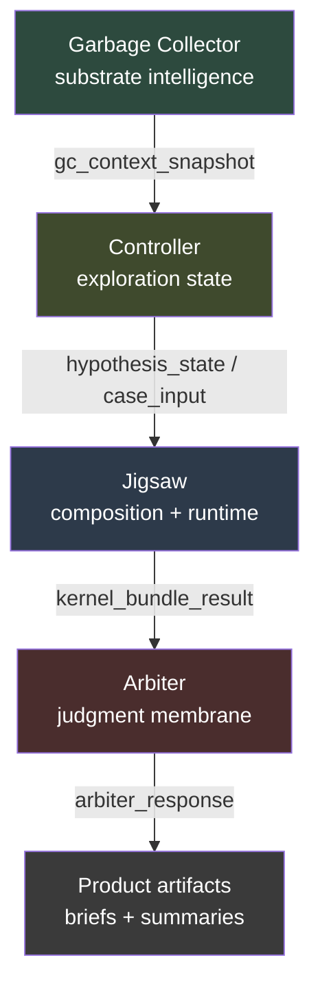
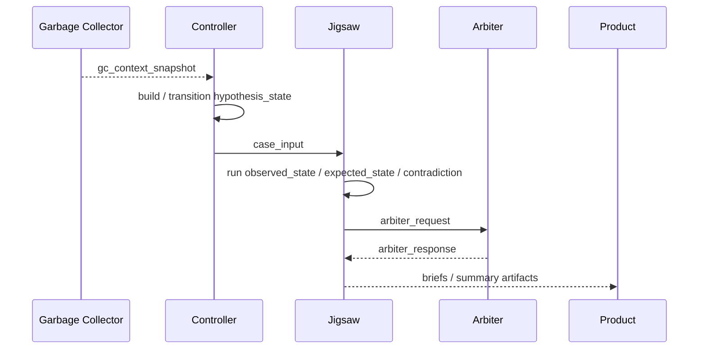

# Framework Overview

This architecture is still a **three-repository system**, but the current Jigsaw repo now contains more explicit internal structure than the older public framing showed.

At the current state:

- **Garbage Collector** is the substrate repo
- **Jigsaw** contains the Controller, composition runtime, execution profiles, and product artifact generation
- **Arbiter** is the judgment membrane repo

The strongest proven slice is the governed forward pass.

## Current Layers

### Garbage Collector

- ingests arbitrary material
- preserves provenance
- links related items
- surfaces grounded context

### Controller

- owns `hypothesis_state`
- transitions state
- selects `next_probe`
- emits `case_input` when a branch is ready to package

### Jigsaw Composition Layer

- consumes `case_input`
- runs bounded kernels
- composes `kernel_bundle_result`
- supports deterministic and LM-backed kernel execution

### Arbiter

- consumes the bounded case through a narrow public membrane
- returns `promoted`, `watchlist`, or `rejected`

### Product Layer

- generates opportunity briefs
- generates summary reports
- emits Markdown and static HTML artifacts

## How They Connect

## What Is Proven

- GC-backed context can enter the Controller through an explicit contract
- the Controller can emit `case_input`
- Jigsaw can compose that input into `kernel_bundle_result`
- Arbiter can judge the resulting bounded case
- execution profiles can run that same spine repeatedly
- deterministic and localmix kernel modes can now reach the same spread on the tested lane

## What Is Not Yet First-Class

- longitudinal case lifecycle management
- action outcome recording
- confidence trajectory over time
- human-assisted revision loop
- Autoresearcher
- companion UI

## Honest Position

The current stack is not just “Jigsaw between GC and Arbiter” anymore.

It is more precisely:

**GC substrate -> Controller state -> Jigsaw composition/runtime -> Arbiter judgment -> product artifact**

That is the current public architecture and the forward-pass demo is the strongest public proof of it.
