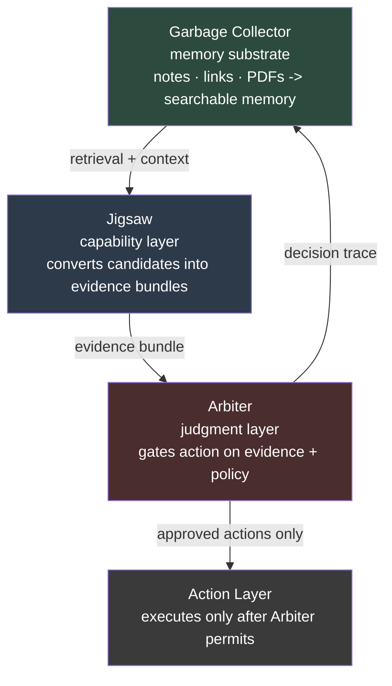
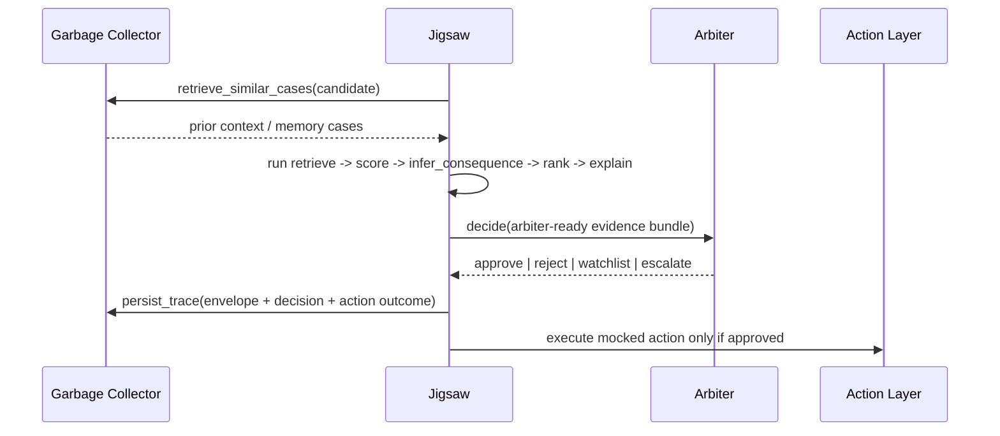

# Framework Overview

This architecture is a **three-repository system**, not a merged codebase.

- Garbage Collector is the memory substrate.
- Jigsaw is the capability and kernel layer.
- Arbiter is the judgment membrane.
- An optional action layer executes only after permission.

Each repo can stand alone. Interoperability happens through contracts and adapters.

## What Each Layer Is

### Garbage Collector

- stores and retrieves prior material
- exposes searchable memory and trace persistence surfaces
- acts as the context and recall substrate

### Jigsaw

- turns a candidate into an explicit evidence bundle
- uses a fixed kernel chain with a shared envelope
- produces inspectable intermediate state and a full audit trace

### Arbiter

- validates evidence sufficiency and judgment inputs
- decides whether action is permitted
- returns a structured gating decision

### Optional Action Layer

- executes only after Arbiter permission
- remains outside the other three repos

## What Each Layer Is Not

### Garbage Collector is not

- the capability chain
- the judge
- a hidden orchestration layer

### Jigsaw is not

- long-term memory
- the action executor
- the policy engine

### Arbiter is not

- the evidence-gathering pipeline
- the memory system
- the side-effect executor

## How They Connect

## Exact Integration Points

### Garbage Collector -> Jigsaw

Required fields:

| Garbage Collector output | Jigsaw field | Required |
| --- | --- | --- |
| item or case identifier | `MemoryCase.case_id` | yes |
| summary or relevant text | `MemoryCase.summary` | yes |
| retrieval score or similarity proxy | `MemoryCase.similarity` | yes |
| provenance metadata | `MemoryCase.provenance` | yes |

Optional fields:

| Garbage Collector output | Jigsaw field | Required |
| --- | --- | --- |
| prior decision outcome | `MemoryCase.outcome` | no |
| richer timestamps | provenance / metadata | no |
| case type tags | provenance / metadata | no |

### Jigsaw -> Arbiter

Required fields:

| Jigsaw output | Arbiter field | Required |
| --- | --- | --- |
| `candidate.candidate_id` | `candidate_id` | yes |
| candidate domain | `domain` | yes |
| `candidate.kind` | `candidate_type` | yes |
| summary or explanation summary | `summary` | yes |
| evidence source count | `evidence.source_count` | yes |
| fit score | `evidence.fit_score` | yes |
| freshness estimate | `evidence.freshness_days` | yes in current public Arbiter |

Optional fields:

| Jigsaw output | Arbiter field | Required |
| --- | --- | --- |
| budget or value band | `evidence.estimated_value_band` | no |
| buyer profile | `context.buyer_profile` | no |
| queue pressure | `context.current_queue_pressure` | no |
| action cost | `context.action_cost` | no |

### Arbiter -> Jigsaw / Action Layer

Required fields:

| Arbiter output | Jigsaw field | Required |
| --- | --- | --- |
| judgement label | `arbiter_decision.decision` | yes |
| confidence | `arbiter_decision.confidence` | yes |
| reason summary | `arbiter_decision.reason` | yes |

Optional fields:

| Arbiter output | Jigsaw field | Required |
| --- | --- | --- |
| key factors | `arbiter_decision.required_follow_up` | no |
| recommended action | `arbiter_decision.required_follow_up` | no |

### Jigsaw -> Garbage Collector After Decision

Required fields:

| Jigsaw trace output | Garbage Collector persistence | Required |
| --- | --- | --- |
| envelope id | trace metadata | yes |
| candidate id | trace metadata | yes |
| final decision | trace metadata / content | yes |
| serialized trace | persisted content | yes |

Optional fields:

| Jigsaw trace output | Garbage Collector persistence | Required |
| --- | --- | --- |
| priority | trace metadata | no |
| fit and confidence | trace metadata | no |
| action outcome | trace content | no |

## What Is Proven

- three independent repos can compose into one coherent stack through explicit contracts
- Jigsaw can remain stable between memory and judgment without absorbing either role
- the evidence path is more inspectable than a monolithic baseline
- the decision path is auditable end-to-end

## What Is Not Yet Proven

- production-grade cross-repo deployment and operations
- a final shared trace-ingestion contract in Garbage Collector
- first-class `escalate` support in the current public Arbiter contract
- broad domain coverage beyond the current narrow proof

## Honest Position

In its current state, this is a coherent architecture with working independent repos, explicit contracts, and demonstrated composition.

It is not yet a merged platform, and it should not become one.
