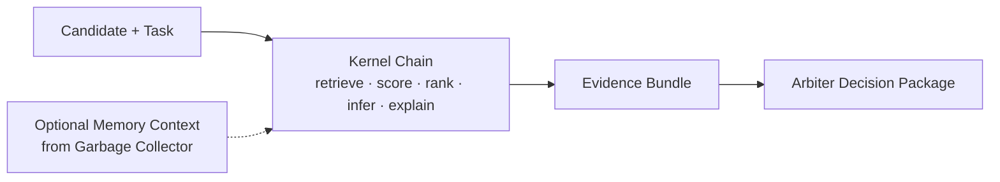

# Jigsaw

Jigsaw is the middle capability layer in a three-layer modular intelligence framework. It owns stable contracts, shaping, composition, artifact-processing lanes, and kernel-family execution between normalized material and final judgment.

- Garbage Collector remembers.
- Jigsaw turns a candidate into an explicit evidence bundle.
- Arbiter decides whether action is permitted.

This repo is a minimal, inspectable implementation of that middle layer.

## What Jigsaw Is

Jigsaw is a standardized kernel chain for turning a candidate item into:

- retrieved context
- explicit evidence
- fit and confidence scores
- inferred consequence estimates
- priority
- structured explanation
- an Arbiter-ready decision packet

The current proof domain is document or opportunity triage.

## What Jigsaw Is Not

Jigsaw is not:

- a memory system
- the Arbiter itself
- a general-purpose agent framework
- a plugin platform
- a production action executor

## Public Role

Within the larger architecture:

- Garbage Collector is the material, normalization, and substrate layer
- Jigsaw is the middle capability layer, shaping, composition, and kernel-family execution layer
- Arbiter is the final judgment membrane

An end-to-end integration proof now exists across the wider framework:

`material -> normalized form -> shaped kernel bundle -> thin adapter -> Arbiter judgment`

Jigsaw can still be used standalone in demo mode. In that mode it ships with local demo adapters for memory and judgment so the kernel chain can be inspected without any other repo.

## Garbage Collector As Intelligence Substrate

Garbage Collector is not just storage or preprocessing.

Its role is to accept arbitrary material, organize it, preserve provenance, link related items, and surface usable context without requiring constant user prompting.

This makes GC the substrate intelligence layer of the wider framework.

In the current architecture:

- **Garbage Collector** ingests, organizes, enriches, cross-references, and surfaces material
- **Jigsaw** shapes cases, runs kernels, and composes bounded analysis
- **Arbiter** decides what should happen next

The purpose of GC is to make raw material progressively more legible and actionable for downstream layers.

GC may be proactive in organizing, linking, and surfacing useful structure, but it is not:

- the final judgment layer
- the full composition layer
- the main adjudication engine

That boundary is intentional. GC creates grounded context and substrate; Jigsaw and Arbiter operate on top of that substrate.

## Systems Alignment Contribution

Jigsaw is not a complete answer to alignment in the broadest philosophical sense.

It does, however, contribute to a serious systems-alignment question:

**How do you build AI-capable systems whose context, exploration, analysis, judgment, and action remain modular, inspectable, and governable instead of collapsing into one opaque agent loop?**

The current stack answers that question in a bounded but practical way:

- **GC** grounds context in provenance-bearing substrate
- **Controller** keeps exploration state explicit
- **Jigsaw** produces bounded analytical outputs under stable contracts
- **Arbiter** acts as a final judgment membrane before action

This matters because failures can be localized to the layer that caused them rather than blamed on "the AI" in general.

The localmix kernel work is a concrete proof of that property:

- runtime remained stable
- retrieval remained stable
- controller and Arbiter boundaries remained stable
- the fault was isolated to kernel semantics
- parity was recovered by moving class-boundary enforcement back into local deterministic normalization

That is a meaningful contribution to operational alignment and governable system design, even though it does not claim to solve deeper value alignment or long-horizon autonomous safety.

## Governed Forward-Pass Demo

A public demo pack is available under [docs/demo/README.md](./docs/demo/README.md).

It shows the current strongest proven slice of the system:
GC-backed context grounding, Controller state, Jigsaw case composition, Arbiter judgment, and readable output artifacts.

## What Has Been Proven

Jigsaw currently has operational proof for three bounded surfaces:

### Phase 1A: artifact interoperability lane

A normalized artifact can enter Jigsaw, be validated, transformed, chunked, and emitted as a stable downstream judgment request with provenance and linkage preserved.

### Phase 1B: first kernel-family lane

A shared `kernel_input` can enter Jigsaw, run through three fixed kernels (`observed_state`, `expected_state`, `contradiction`), and emit a composed `kernel_bundle_result` with evidence and lineage preserved.

### Integration proof into current Arbiter

A Jigsaw `kernel_bundle_result` can be passed through a thin adapter into Arbiter's current public request/response membrane and receive a valid Arbiter judgment without redesigning Arbiter.

### Bounded local-model proofs

Small local LMs were inserted into the `observed_state` and `expected_state` kernel slots using LM Studio, with the real Jigsaw contract, validator, bundle composition, and Arbiter handoff left unchanged. In both single-slot cases the local path achieved downstream `watchlist` parity with the deterministic baseline on the tested case.

Jigsaw now also has a bounded mixed-bundle proof:

- LM-backed `observed_state`
- LM-backed `expected_state`
- deterministic `contradiction`

That mixed local bundle remained contract-valid, composed cleanly, and still produced downstream `watchlist` through the current Arbiter membrane on the tested case.

This is a bounded proof of local-model viability inside Jigsaw, not a claim of universal parity across all slots or cases.

This proves Jigsaw is not just passive schema storage. It is an operational middle capability layer.

### Execution profile proof

Jigsaw now supports standardized execution profiles for repeatable real-case runs. The first calibrated profile, `remote_workflow_v1b`, ran five live GC-backed cases through one fixed selection, shaping, kernel, and Arbiter path and produced a believable spread of outcomes (`2 promoted`, `3 watchlist`, `0 rejected`) rather than uniformly flattering results.

### Product-slice proof

The calibrated `remote_workflow_v1b` profile now also produces a user-consumable Remote Workflow Opportunity Brief pack, with one markdown brief and one polished static HTML brief per case covering the primary item, supporting items, case summary, bundle judgment, Arbiter result, bounded rationale, and next-action guidance.

## Boundary Discipline

Jigsaw is intentionally not:

- the raw ingestion substrate
- the final judgment membrane
- a generic middleware blob

Its role is to provide:

- contract stability
- shaping and composition
- reusable middle-layer execution lanes
- a home for kernel-family capability under shared discipline

Source-specific irregularity belongs in adapters.
Final judgment belongs downstream.

## Role In The Larger Stack

```text
Garbage Collector -> Jigsaw -> Arbiter -> Action
```

- Garbage Collector provides prior cases and stores completed traces.
- Jigsaw gathers and transforms evidence through five fixed kernels.
- Arbiter gates action.
- Action is mocked in this repo and executes only on approval.

## Conceptual Role



## Public Interfaces

Jigsaw’s public integration surfaces are explicit contracts, not direct cross-repo imports:

- [MESSAGE_BUS_SCHEMA.md](./MESSAGE_BUS_SCHEMA.md)
- [MEMORY_CONTRACT.md](./MEMORY_CONTRACT.md)
- [ARBITER_DECISION_CONTRACT.md](./ARBITER_DECISION_CONTRACT.md)
- [SHARED_KERNEL_FRAMEWORK_STATUS.md](./SHARED_KERNEL_FRAMEWORK_STATUS.md)
- [SYSTEM_POSITIONING.md](./SYSTEM_POSITIONING.md)
- [FRAMEWORK_OVERVIEW.md](./FRAMEWORK_OVERVIEW.md)

Jigsaw also now supports `kernel.v1` as a first-class ingest contract for shared engine results, while keeping `MessageEnvelope` as its native internal runtime shape.

## Canonical Contract Source

`kernel.v1` is canonically defined in the standalone `kernel-contracts` repo.

Jigsaw keeps a local schema snapshot for native ingest validation, but that snapshot is a pinned derivative, not the source of truth. Current alignment target:

- `kernel-contracts` `0.1.0`

Drift policy:

- contract changes originate in `kernel-contracts` first
- Jigsaw updates its local snapshot deliberately afterward
- local schema or fixture edits here should not redefine `kernel.v1`

## Kernel Chain

The current kernel set is fixed and intentionally small:

1. `retrieve`
2. `score`
3. `infer_consequence`
4. `rank`
5. `explain`

Every kernel accepts and returns the same `MessageEnvelope`.

## Quickstart

Run the local demo mode:

```powershell
python -m jigsaw.runner
python -m jigsaw.benchmark
```

Run against real sibling repos when available:

```powershell
$env:JIGSAW_ADAPTER_MODE="real"
$env:JIGSAW_GC_BASE_URL="http://127.0.0.1:8000"   # optional
$env:JIGSAW_GC_SQLITE_PATH="C:\path\to\garbage_collector.db"   # optional
$env:JIGSAW_ARBITER_REPO="C:\path\to\arbiter-public"
python -m jigsaw.runner
python -m jigsaw.benchmark
```

Optional environment variables for real mode:

- `JIGSAW_GC_BASE_URL`: use a running Garbage Collector API such as `http://127.0.0.1:8000`
- `JIGSAW_GC_SQLITE_PATH`: path to `garbage_collector.db`
- `JIGSAW_ARBITER_REPO`: path to the Arbiter repo root
- `JIGSAW_DEV_SIBLING_DISCOVERY=1`: optional local-dev shortcut to auto-discover sibling repos in the same parent directory

Sibling repo discovery is a local development convenience only. It is not the canonical integration mechanism.

## Benchmark Meaning

The benchmark compares three paths:

1. ungated baseline
2. gated Jigsaw flow
3. memory-informed gated Jigsaw flow

The point is not to maximize actions. The point is to show that:

- the baseline acts with little explanation
- Jigsaw produces explicit evidence and a full trace
- memory changes the available evidence without changing the kernel contracts
- action remains gated by Arbiter

## Current Limitations

- the public Arbiter contract exposes `promoted`, `watchlist`, and `rejected`, not Jigsaw's full four-way set
- `escalate` remains available in demo mode and in any richer private Arbiter implementation
- Garbage Collector has no dedicated trace-ingestion endpoint yet
- real memory persistence therefore maps traces either into the existing `items` API or directly into the existing SQLite schema as `jigsaw_trace`
- SQLite fallback retrieval uses lexical overlap, not the full Garbage Collector semantic API
- the proof remains narrow by design and does not claim production readiness

## Proven Now

- the five-kernel chain composes cleanly through one shared envelope
- Jigsaw can run standalone or through thin adapters
- audit trace behavior remains stable across demo and adapter-backed flows
- the capability layer can stay separate from memory and judgment repos
- valid `kernel.v1` payloads can be ingested natively and converted into Jigsaw's runtime envelope

## Not Yet Proven

- a production-grade cross-repo deployment contract
- full four-way Arbiter parity including first-class `escalate`
- case-oriented memory semantics in Garbage Collector
- generalization beyond the current narrow triage wedge

## Key Files

- [ARCHITECTURE_OVERVIEW.md](./ARCHITECTURE_OVERVIEW.md)
- [ARCHITECTURE_DIAGRAM.md](./ARCHITECTURE_DIAGRAM.md)
- [EXTERNAL_SUMMARY.md](./EXTERNAL_SUMMARY.md)
- [OPERATIONAL_PROOF.md](./OPERATIONAL_PROOF.md)
- [ARBITER_COMPRESSION_AUDIT.md](./ARBITER_COMPRESSION_AUDIT.md)
- [docs/EXECUTION_PROFILE_SPEC.md](./docs/EXECUTION_PROFILE_SPEC.md)
- [validation/kernel_lmstudio_test/FINAL_RESULT.md](./validation/kernel_lmstudio_test/FINAL_RESULT.md)
- [validation/kernel_lmstudio_test/VALIDATION_NOTE.md](./validation/kernel_lmstudio_test/VALIDATION_NOTE.md)
- [validation/kernel_lmstudio_test/ADAPTER_SENSITIVITY_NOTE.md](./validation/kernel_lmstudio_test/ADAPTER_SENSITIVITY_NOTE.md)
- [validation/kernel_lmstudio_expected_test/FINAL_RESULT.md](./validation/kernel_lmstudio_expected_test/FINAL_RESULT.md)
- [validation/kernel_lmstudio_expected_test/VALIDATION_NOTE.md](./validation/kernel_lmstudio_expected_test/VALIDATION_NOTE.md)
- [validation/kernel_lmstudio_mixed_test/FINAL_RESULT.md](./validation/kernel_lmstudio_mixed_test/FINAL_RESULT.md)
- [validation/kernel_lmstudio_mixed_test/VALIDATION_NOTE.md](./validation/kernel_lmstudio_mixed_test/VALIDATION_NOTE.md)
- [validation/execution_profiles/remote_workflow_v1b/SUMMARY.md](./validation/execution_profiles/remote_workflow_v1b/SUMMARY.md)
- [validation/execution_profiles/remote_workflow_v1b/briefs/README.md](./validation/execution_profiles/remote_workflow_v1b/briefs/README.md)
- [validation/execution_profiles/remote_workflow_v1b/briefs/case_01_gc_8.html](./validation/execution_profiles/remote_workflow_v1b/briefs/case_01_gc_8.html)
- [MESSAGE_BUS_SCHEMA.md](./MESSAGE_BUS_SCHEMA.md)
- [MEMORY_CONTRACT.md](./MEMORY_CONTRACT.md)
- [ARBITER_DECISION_CONTRACT.md](./ARBITER_DECISION_CONTRACT.md)
- [SYSTEM_POSITIONING.md](./SYSTEM_POSITIONING.md)
- [FRAMEWORK_OVERVIEW.md](./FRAMEWORK_OVERVIEW.md)
- [CLAIM_OF_PROOF.md](./CLAIM_OF_PROOF.md)
- [INTEGRATION_NOTES.md](./INTEGRATION_NOTES.md)
- [SHARED_KERNEL_FRAMEWORK_STATUS.md](./SHARED_KERNEL_FRAMEWORK_STATUS.md)
