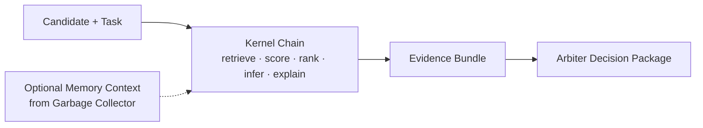

# Jigsaw

Jigsaw is the middle capability layer between memory and judgment.

- Garbage Collector remembers.
- Jigsaw turns a candidate into an explicit evidence bundle.
- Arbiter decides whether action is permitted.

This repo is a minimal, inspectable implementation of that middle layer.

## What Jigsaw Is

Jigsaw is a standardized kernel chain for turning a candidate item into:

- retrieved context
- explicit evidence
- fit and confidence scores
- inferred consequence estimates
- priority
- structured explanation
- an Arbiter-ready decision packet

The current proof domain is document or opportunity triage.

## What Jigsaw Is Not

Jigsaw is not:

- a memory system
- the Arbiter itself
- a general-purpose agent framework
- a plugin platform
- a production action executor

## Public Role

Within the larger architecture:

- Garbage Collector is the memory substrate
- Jigsaw is the capability and kernel layer
- Arbiter is the judgment membrane

Jigsaw can still be used standalone in demo mode. In that mode it ships with local demo adapters for memory and judgment so the kernel chain can be inspected without any other repo.

## Role In The Larger Stack

```text
Garbage Collector -> Jigsaw -> Arbiter -> Action
```

- Garbage Collector provides prior cases and stores completed traces.
- Jigsaw gathers and transforms evidence through five fixed kernels.
- Arbiter gates action.
- Action is mocked in this repo and executes only on approval.

## Conceptual Role



## Public Interfaces

Jigsaw’s public integration surfaces are explicit contracts, not direct cross-repo imports:

- [MESSAGE_BUS_SCHEMA.md](./MESSAGE_BUS_SCHEMA.md)
- [MEMORY_CONTRACT.md](./MEMORY_CONTRACT.md)
- [ARBITER_DECISION_CONTRACT.md](./ARBITER_DECISION_CONTRACT.md)
- [SYSTEM_POSITIONING.md](./SYSTEM_POSITIONING.md)
- [FRAMEWORK_OVERVIEW.md](./FRAMEWORK_OVERVIEW.md)

## Kernel Chain

The current kernel set is fixed and intentionally small:

1. `retrieve`
2. `score`
3. `infer_consequence`
4. `rank`
5. `explain`

Every kernel accepts and returns the same `MessageEnvelope`.

## Quickstart

Run the local demo mode:

```powershell
python -m jigsaw.runner
python -m jigsaw.benchmark
```

Run against real sibling repos when available:

```powershell
$env:JIGSAW_ADAPTER_MODE="real"
$env:JIGSAW_GC_BASE_URL="http://127.0.0.1:8000"   # optional
$env:JIGSAW_GC_SQLITE_PATH="C:\path\to\garbage_collector.db"   # optional
$env:JIGSAW_ARBITER_REPO="C:\path\to\arbiter-public"
python -m jigsaw.runner
python -m jigsaw.benchmark
```

Optional environment variables for real mode:

- `JIGSAW_GC_BASE_URL`: use a running Garbage Collector API such as `http://127.0.0.1:8000`
- `JIGSAW_GC_SQLITE_PATH`: path to `garbage_collector.db`
- `JIGSAW_ARBITER_REPO`: path to the Arbiter repo root
- `JIGSAW_DEV_SIBLING_DISCOVERY=1`: optional local-dev shortcut to auto-discover sibling repos in the same parent directory

Sibling repo discovery is a local development convenience only. It is not the canonical integration mechanism.

## Benchmark Meaning

The benchmark compares three paths:

1. ungated baseline
2. gated Jigsaw flow
3. memory-informed gated Jigsaw flow

The point is not to maximize actions. The point is to show that:

- the baseline acts with little explanation
- Jigsaw produces explicit evidence and a full trace
- memory changes the available evidence without changing the kernel contracts
- action remains gated by Arbiter

## Current Limitations

- the public Arbiter contract exposes `promoted`, `watchlist`, and `rejected`, not Jigsaw's full four-way set
- `escalate` remains available in demo mode and in any richer private Arbiter implementation
- Garbage Collector has no dedicated trace-ingestion endpoint yet
- real memory persistence therefore maps traces either into the existing `items` API or directly into the existing SQLite schema as `jigsaw_trace`
- SQLite fallback retrieval uses lexical overlap, not the full Garbage Collector semantic API
- the proof remains narrow by design and does not claim production readiness

## Proven Now

- the five-kernel chain composes cleanly through one shared envelope
- Jigsaw can run standalone or through thin adapters
- audit trace behavior remains stable across demo and adapter-backed flows
- the capability layer can stay separate from memory and judgment repos

## Not Yet Proven

- a production-grade cross-repo deployment contract
- full four-way Arbiter parity including first-class `escalate`
- case-oriented memory semantics in Garbage Collector
- generalization beyond the current narrow triage wedge

## Key Files

- [ARCHITECTURE_OVERVIEW.md](./ARCHITECTURE_OVERVIEW.md)
- [MESSAGE_BUS_SCHEMA.md](./MESSAGE_BUS_SCHEMA.md)
- [MEMORY_CONTRACT.md](./MEMORY_CONTRACT.md)
- [ARBITER_DECISION_CONTRACT.md](./ARBITER_DECISION_CONTRACT.md)
- [SYSTEM_POSITIONING.md](./SYSTEM_POSITIONING.md)
- [FRAMEWORK_OVERVIEW.md](./FRAMEWORK_OVERVIEW.md)
- [CLAIM_OF_PROOF.md](./CLAIM_OF_PROOF.md)
- [INTEGRATION_NOTES.md](./INTEGRATION_NOTES.md)
